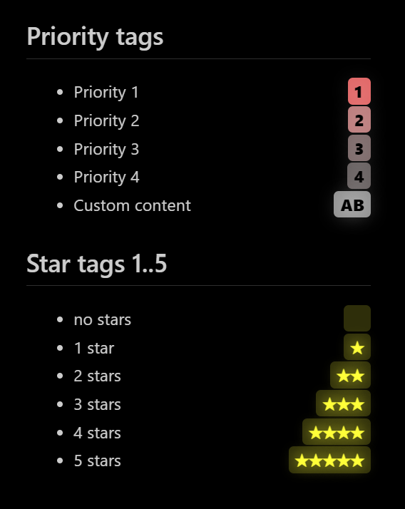
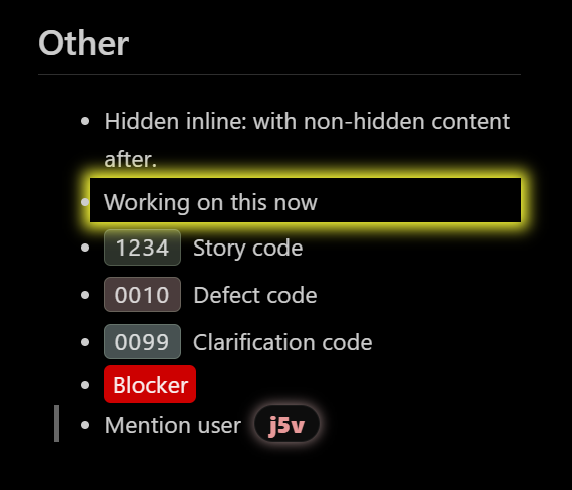
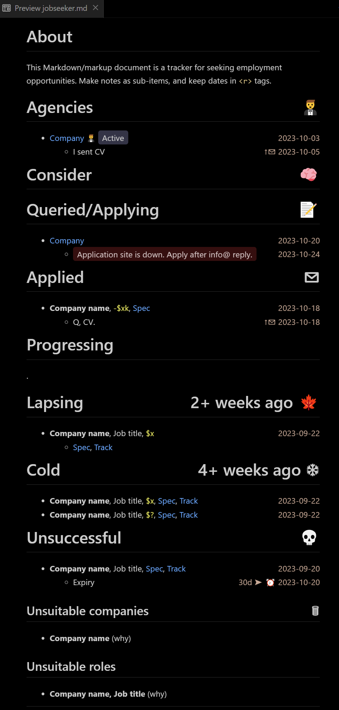

`markdown-todos` gives you CSS for Markdown documents viewed in VSCode preview, to indicate the status of items in your nested todo lists.


# Installation

Find custom CSS code in the [`/src`](/src) folder.

To affect only the current Markdown preview, paste the custom CSS code into a `<style>` tag in the Markdown source. [This is what I do - j5v]

To affect all Markdown previews in the current VSCode workspace, or for all VSCode workspaces:
1. Select **File** > **Preferences** > **Settings**.
2. Type **Style** in the settings filter.
3. Select **User** to affect all workspaces, or **Workspace** to affect the current workspace.
4. Select **Extensions** > **Markdown** from the settings categories.
5. In the **Markdown: Styles** setting, add the location of your CSS file.

You can add more than one CSS file.


# Example usage

When the `simple todo.md` CSS is active, place `<todo>` tags at the beginning of your item text, and progress them through yellow `<wip>`, then green `<done>` states.

```Markdown
# Category
- <done>Thing
- <wip>Another thing
	- Part 1
	- Part 2
- <todo>Last thing
- <todo>Really the last thing
```

To activate a live Markdown preview in VSCode, press Ctrl+Shift+V.


# Modules

## [Simple todo](src/simple-todo.md)


## [Priority and stars](src/priority-and-stars.md)


## [Other](src/other.md)


## [Jobseeker](src/jobseeker.md)



# See also

* [Customization hints](docs/customization-hints.md)
