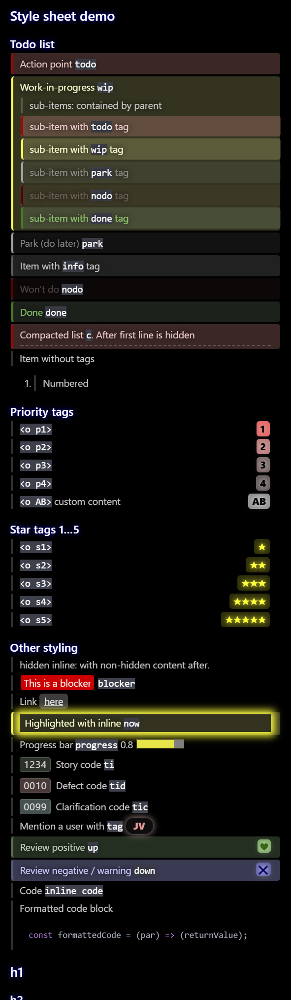

# markdown-todos
CSS for your Atom+Markdown lists.

This CSS gives you a visual hint of the status of items in your nested todo lists.

For basic usage, place `<todo>` tags at the beginning of your item text, and progress them through yellow `wip`, then green `done` states. Feel free to make your own CSS if you have difficulty distinguishing the colors I have chosen here.

Other tags have been styled to assist with common software development tasks. Most are shown in the preview below.

# You will need
- Atom editor
- `markdown-preview-plus` package, v.3.8.1

# How to install
Open the `add to styles.less` file, and paste its contents into your `styles.less` file (found in Atom's menu: File > Stylesheet...).

Alternatively, you can paste it into an `.md` file, inside a `<style>` tag, but we recommend the `styles.less` method above.

You might also want to configure the markdown stylesheet `default.less` to have:
```css
@bg: black;
body {
  padding: 1em 1.5em 1em 0.5em;
}
```

# What it looks like


# Expected use

This is not intended to replace job management tools (like Trello, Jira, and ServiceNow Agile), but it can be helpful for ad-hoc todo lists, lists that are very fluid, or lists of quick todos.
